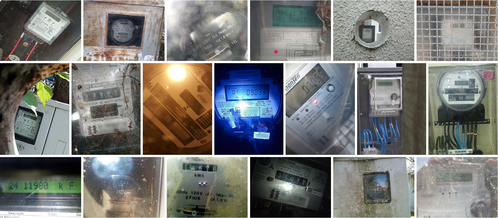

# Copel-AMR Dataset ([Website](https://web.inf.ufpr.br/vri/databases/copel-amr/))

This dataset, called **Copel-AMR**, contains 12,500 meter images acquired in the field by the employees of the Energy Company of Paraná (Copel), which directly serves more than 4 million consuming units, across 395 cities and 1,113 locations (i.e., districts, villages and settlements), located in the Brazilian state of Paraná. It was introduced in our paper [[PDF]](./pdfs/laroca2021towards.pdf).

Copel-AMR is composed of images captured in **unconstrained scenarios**, which typically include blur (due to camera motion), dirt, scale variations, in-plane and out-of-plane rotations, reflections, shadows, and occlusions. In 2,500 images (i.e., 20% of the dataset), it is not even possible to perform the meter reading due to occlusions or faulty meters. 

The images have a resolution of 480×640 or 640×480 pixels, depending on the orientation in which they were taken. Considering that the meter is operational and that there are no occlusions, these resolutions are enough for the meter reading to be legible.

The dataset was randomly split as follows: 5,000 images for training, 5,000 images for testing and 2,500 images for validation, following the split protocol (i.e., 40%/40%/20%) used in the [UFPR-AMR](https://github.com/raysonlaroca/ufpr-amr-dataset) dataset. For reproducibility purposes, the subsets generated are explicitly available along with the Copel-AMR dataset.

For each image in our dataset, we manually labeled the meter reading, the position (x, y) of each of the four corners of the counter, and a bounding box (x, y, w, h) for each digit. Corner annotations – which can be converted to a bounding box – enable the counter to be rectified, while bounding boxes enable the training of object detectors. The full details are in our [paper](./pdfs/laroca2021towards.pdf).

Here are some examples from the dataset:  
<p align="center">
    
</p>

## How to obtain the dataset

The Copel-AMR dataset is the property of the Energy Company of Paraná (Copel) and is released **only** to academic researchers from educational or research institutes for **non-commercial purposes**. 

To be able to download the dataset, please read carefully [**this license agreement**](./pdfs/license-agreement.pdf), fill it out and send it back to Professor David Menotti ([menotti@inf.ufpr.br](mailto:menotti@inf.ufpr.br)). The license agreement MUST be reviewed and signed by the individual or entity authorized to make legal commitments on behalf of the institution or corporation (e.g., Department/Administrative Head, or similar). **We cannot accept licenses signed by students or faculty members.**

## Citation

If you use the Copel-AMR dataset in your research, please cite our paper:

* R. Laroca, A. B. Araujo, L. A. Zanlorensi, E. C. de Almeida, D. Menotti, “*Towards Image-based Automatic Meter Reading in Unconstrained Scenarios: A Robust and Efficient Approach*,” IEEE Access, vol. 9, pp. 67569-67584, 2021. [[IEEE Xplore]](https://doi.org/10.1109/ACCESS.2021.3077415) [[arXiv]](https://arxiv.org/abs/2009.10181)

```
@ARTICLE{laroca2021towards,
  author={R. {Laroca} and A. B. {Araujo} and L. A. {Zanlorensi} and Eduardo C. {de Almeida} and D. {Menotti}},
  journal={IEEE Access}, 
  title={Towards Image-Based Automatic Meter Reading in Unconstrained Scenarios: A Robust and Efficient Approach}, 
  year={2021},
  volume={9},
  number={},
  pages={67569-67584},
  ISSN={2169-3536},
  doi={10.1109/ACCESS.2021.3077415}
}
```

You may also be interested in our previous research, where we introduced the [UFPR-AMR](https://github.com/raysonlaroca/ufpr-amr-dataset) dataset:

* R. Laroca, V. Barroso, M. A. Diniz, G. R. Gonçalves, W. R. Schwartz, D. Menotti, “*Convolutional Neural Networks for Automatic Meter Reading*,” Journal of Electronic Imaging, vol. 28, no. 1, p. 013023, 2019. [[SPIE Digital Library]](https://doi.org/10.1117/1.JEI.28.1.013023) [[arXiv]](https://arxiv.org/abs/1902.09600)

## Related Works

A list of all articles on AMR published by us can be seen [here](https://scholar.google.com/scholar?hl=pt-BR&as_sdt=0%2C5&as_ylo=2019&q=allintitle%3A+meter+reading+author%3ARayson+author%3ALaroca&btnG=).

## Contact

Please contact Professor David Menotti ([menotti@inf.ufpr.br](mailto:menotti@inf.ufpr.br)) with questions or comments.
